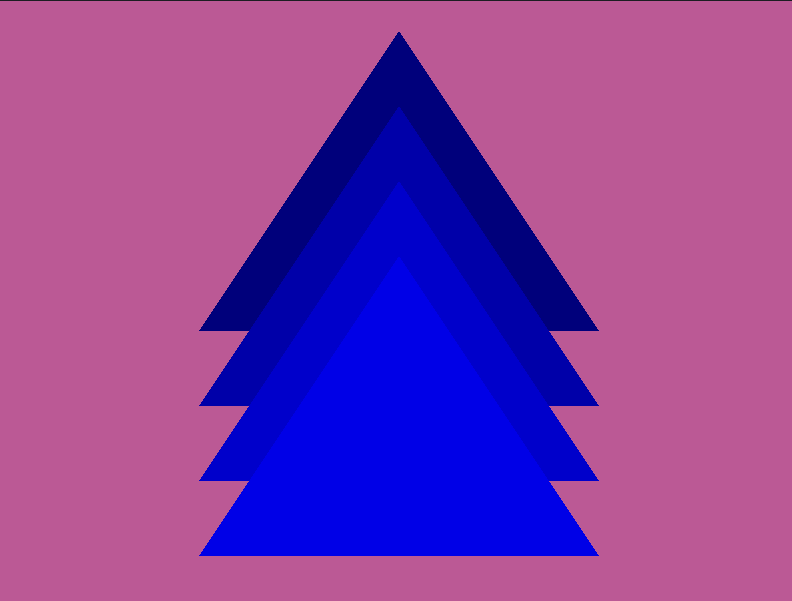

# Basic Triangle
project Name: 1-triangle

## Description
A minimal **Vulkan + C++** application that renders a single colored triangle to the screen.
This project is intended as a **starting point for Vulkan graphics programming**, focusing on understanding the core Vulkan setup and rendering pipeline rather than abstraction or engine design.

## Output

